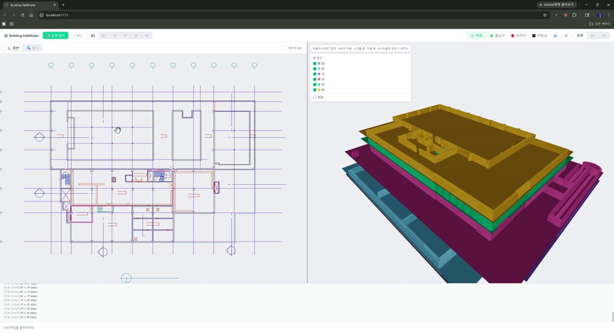
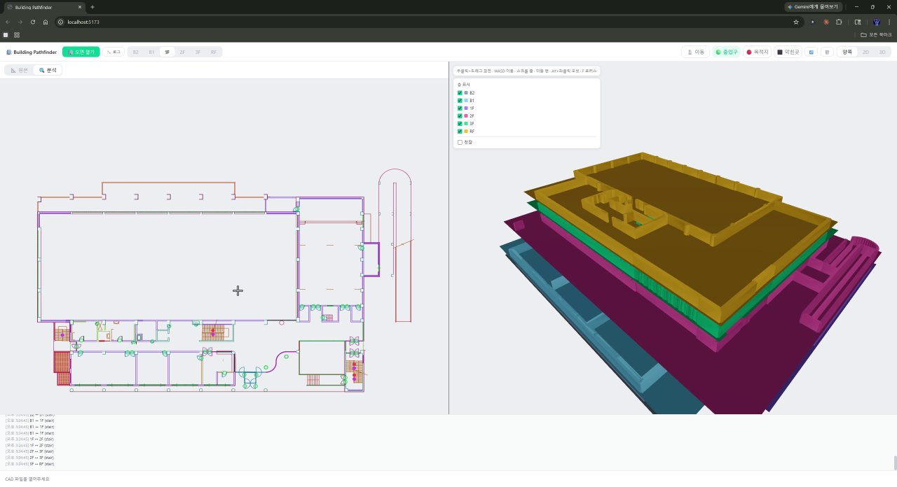
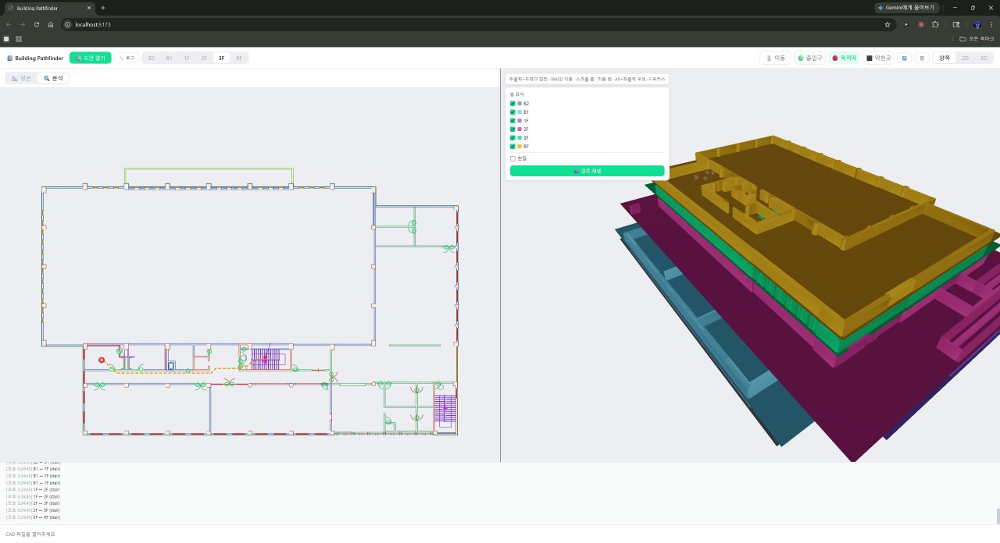
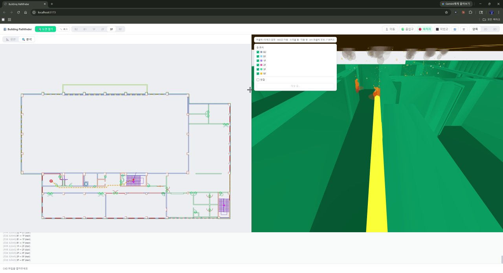

# Building Pathfinder

건물 CAD 도면(DXF) → 다층 화재 대피 경로 시뮬레이션. 2D에서 출발/도착 클릭만 하면 A*가 다층 경로를 계산하고 3D 뷰어에서 트윙클 튜브와 도착지 불 이펙트로 시각화합니다.

> **AI 자동 분류 + 모양 기반 분류 하이브리드** — Claude Vision으로 레이어 1차 분류, ARC 모양으로 문 2차 검출. CAD 도면의 일관성 부재를 우회.

> **수동 정합 0** — 계단 투표 알고리즘 + 인접 층 체이닝으로 7개 층(B2~RO) 자동 정합 완료.

---

## 데모

### 디자인 데모 영상 (30초 발췌)

<video src="assets/pathfinder-demo.mp4" poster="assets/pathfinder-02.jpg" controls width="100%"></video>

[▶ 영상 다운로드](assets/pathfinder-demo.mp4)

> 2D 도면 로드 → 분석 모드 전환 → 출발/도착 클릭 → 3D 트윙클 튜브 + 도착지 불 이펙트 + 카메라 플라이스루.

---

## 스크린샷

### 2D + 3D 분할 뷰 (B2 도면 + 7층 분해도)

> 좌: 원본 DXF 레이어별 색상 + 레이어 토글 · 우: 7개 층(B2/B1/1F/2F/3F/RF/RO)이 elevation별로 분리된 분해도. 각 층 색상으로 시인성 확보.

### 1F 분석 뷰 — 문/계단 자동 감지

> 분석 모드: 구조물 레이어만 표시 + 문(초록 동그라미) + 계단(빨강/마젠타 점) 오버레이. 좌측 큰 홀과 후방 사무실 군집의 문이 모두 감지됨.

### 3F 경로 표시 — 출발(S) → 도착(D)

> 클릭 한 번으로 다층 A* 경로 계산. 우측 패널에 "경로 재생" 버튼 활성화.

### 3D 카메라 플라이스루 + 도착지 불 이펙트

> 노란 트윙클 튜브가 경로를 따라 흐르고, 도착지 반경 5m 내 6곳 불 이펙트(파티클 3종 + 포인트라이트). 카메라는 출발→도착을 광각 FOV 90°로 자동 플라이스루.

---

## 시스템 구조

```
┌─────────────┐    ┌──────────────┐    ┌────────────────────────────────────────────────┐
│  DXF 도면   │───▶│ ezdxf(Python)│───▶│          브라우저 (TypeScript + React)          │
│ (AutoCAD)   │    │ + Claude AI  │    │                                                │
└─────────────┘    │ 레이어 분류  │    │  JSON ─▶ 기하추출 ─▶ 그래프 ─▶ A* ─▶ 시각화    │
                   └──────────────┘    └────────────────────────────────────────────────┘
```

```
DXF → ezdxf JSON (+ Claude Vision 레이어 분류)
  ↓
extract-geometry  (ARC 모양 기반 문 감지 + 평행선 패턴 계단 감지)
  ↓
floor-align       (STAIR LINE 투표 + 인접 층 체이닝)
  ↓
graph-build       (그리드 + 문 갭 분할 + Union-Find 컴포넌트 브릿징)
  ↓
multi-floor-graph (층별 그래프 통합 + 계단 기반 층간 엣지)
  ↓
A* pathfinder     (다층 경로 계산)
  ↓
Viewer2D + Viewer3D (트윙클 튜브 + 불 이펙트 + 카메라 플라이스루)
```

## 기술 스택

- **프론트엔드**: Vite · React 19 · TypeScript · Zustand
- **3D**: Three.js · @react-three/fiber
- **전처리**: Python ezdxf → JSON
- **AI 분류**: Claude Vision (레이어 용도 자동 분류)
- **알고리즘**: A* (Euclidean heuristic) · Union-Find · 계단 투표

## 핵심 모듈

| 파일 | 역할 |
|------|------|
| `src/pipeline/stages/extract-geometry.ts` | 엔티티 → 벽/문/계단 분류 (모양 기반) |
| `src/pipeline/stages/graph-build.ts` | 기하 → 그리드 그래프 + 문 갭 분할 + 컴포넌트 브릿징 |
| `src/pipeline/stages/floor-align.ts` | 다층 자동 정합 (STAIR LINE 투표 + 체이닝) |
| `src/pipeline/stages/multi-floor-graph.ts` | 층별 그래프 → 통합 + 층간 엣지 |
| `src/engine/pathfinder.ts` | A* (양방향 엣지, Euclidean) |
| `src/viewer/Viewer2D.tsx` | 2D 캔버스 렌더링 + 경로 표시 |
| `src/viewer/Viewer3D.tsx` | 3D 건물 + 경로 연출 + Unity 카메라 |
| `src/app/store.ts` | Zustand 상태 (다층 로드/전환/경로) |

## 분류 로직 — ARC 모양 기반 문 감지

```
엔티티 하나 입력
  │
  ├─ ARC 모양이 문인가? ───────────── YES ──▶ 문 (DoorOpening)
  │   조건: 반지름 400~2000mm                    레이어 무관
  │         각도 30~180°                          (단, 기둥/난간/계단 제외)
  │         근처에 벽 LINE 끝점 존재
  │
  ├─ 비구조물 레이어 ─────────────── YES ──▶ 무시
  ├─ 계단 레이어 ─────────────────── YES ──▶ 벽에서 제외 (통과 가능)
  │
  └─ 나머지 전부 ─────────────────────────▶ 벽 (WallSegment)
```

**계단 감지** = 평행선 패턴(150~400mm 간격 4개+) **AND** 계단 레이어 (둘 다 충족 필수).

## 다층 자동 정합 — 계단 투표

```
기준층 계단 × 대상층 계단 = 모든 쌍의 오프셋 후보
  ↓
각 후보 오프셋으로 다른 계단들도 매칭되는지 투표
  └─ 정합 후 5m 이내 → +1 투표
  ↓
최다 투표 오프셋 = 최종 오프셋
```

**체이닝**: 1F를 원점(0,0)으로 고정 → B2 ← B1 ← 1F → 2F → 3F → RF 순서로 인접 층끼리 정합 → 오프셋 누적. 폴백: 벽 중심(centroid) 매칭.

## 3D 뷰어 — Unity Scene View 카메라

| 입력 | 동작 |
|------|------|
| 우클릭 드래그 | 시점 회전 |
| 우클릭 + WASD | 이동 |
| Alt + 좌클릭 | 건물 중심 오빗 |
| 미들 드래그 | 팬 |
| 스크롤 | 줌 |
| F | 포커스 |

**경로 재생**: 출발 0.5초 대기 → 이동(FOV 90° 광각) → 도착 1.5초 오빗 → 각도 유지 종료. 트윙클 튜브 라인은 TubeGeometry + emissive 펄스. 도착지 불 이펙트는 반경 5m 내 6곳, 파티클 3종 + 포인트라이트.

## 핵심 설계 결정과 근거

| 항목 | 값 | 이유 |
|------|-----|------|
| 좌표계 | 렌더링=원본, 길찾기=정합 | 렌더링 정확도 vs 경로 일관성 동시 충족 |
| 문 감지 | ARC 형태 + 벽 끝점 검증 | 스타일 무관, 곡선벽 오탐 방지 |
| 문 위치 | 경첩↔닫힘끝점 중점 | 경첩 위치는 벽 관통 유발 |
| 계단 감지 | 레이어 + 평행선 패턴 AND | 레이어만으로는 부정확, 패턴만으로는 가구 오탐 |
| 계단 벽 | 계단 레이어 엔티티만 제외 | 경계벽(WALL 레이어) 보존해야 벽 관통 방지 |
| 정합 | STAIR LINE만 투표 | ELE/ELE3 포함 시 중심 왜곡 |
| 문 갭 threshold | 600mm | 이중선 벽(두꺼운 벽) 대응 |
| 3D 벽 | 400mm × 2m 압출 | 건물 느낌 + 좁은 틈 막기 |
| 그리드 크기 | `max(300, min(2000, sqrt(면적/20000)))` ≈ 350mm | 도면 크기에 자동 적응 |

## 실패한 접근 (반복 금지)

| 접근 | 실패 이유 | 대안 |
|------|----------|------|
| 레이어 기반 문 분류 | 같은 레이어에 벽+문 혼재 (예: 신설창호) | 엔티티 ARC 모양 기반 |
| 전체 ARC를 문 처리 | 곡선벽, 계단ARC 오탐 | 크기+각도+근처벽끝점 AND 조건 |
| `wallLayerSet`으로 문 제외 | 신설창호 등 혼합 레이어 문 누락 | `neverDoorSet`(기둥/난간/계단)만 제외 |
| 패턴만으로 계단 감지 | 가구/설비 평행선 오탐 | 패턴 AND 계단레이어 |
| 기둥 패턴 정합 | CIRCLE만 → B1/B2 없음 / 전체 → 오매칭 | 계단 투표 정합 |
| 벽 중심 정합만 | Y오프셋 ~4000mm 오차 | 계단 투표 1차 + 벽 중심 폴백 |
| 1F 기준 전층 직접 정합 | 공유 계단 없는 먼 층(RF↔1F) 오매칭 | 인접 층 체이닝 |
| 계단 내 노드 배치 금지 | 경로가 계단 통과 불가 | 계단 내부 벽 제거 후 노드 허용 |
| 문 갭 threshold 300mm | 두꺼운 벽 갭 안 열림 | 600mm로 확대 |

## 샘플 데이터

`samples/국민생활관/output/` — 7개 층 ezdxf JSON (B2, B1, 1F, 2F, 3F, RF, RO)

## 실행

```bash
npm install
npm run dev      # Vite 개발 서버 (http://localhost:5173)
npm run build    # 프로덕션 빌드
npm test         # 연결성 테스트
```

## 사용법

1. **파일 열기** — `📄 1개 층` 또는 `🏢 다층 로드` (여러 층 동시 선택)
2. **출발/도착 지정** — 2D에서 `🟢 출입구` 모드 → 출발점 클릭, `🔴 목적지` 모드 → 도착점 클릭
3. **3D 재생** — 자동 트윙클 튜브 + 불 이펙트 + `경로 재생` 버튼으로 카메라 플라이스루

## 로드맵

| 단계 | 내용 | 상태 |
|------|------|------|
| 1 | 같은 층 A* 길찾기 | 완료 |
| 2 | 층간 이동 (정합 + 통합 그래프) | 완료 |
| 3 | 3D 시각화 | 완료 |
| 4 | 3D + 길찾기 | 완료 |
| 5 | 대피 시뮬레이션 (군중 흐름, 화재 확산) | 미착수 |
