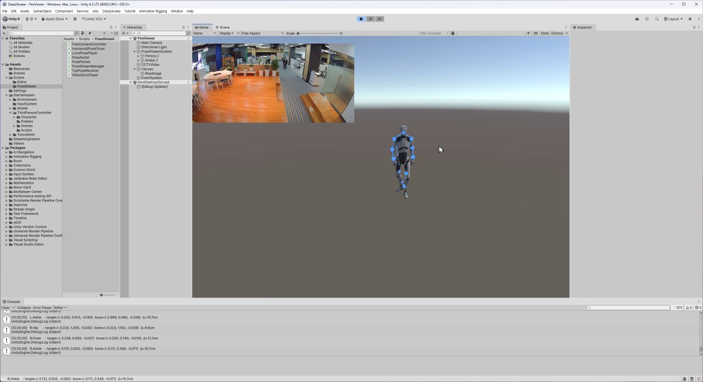
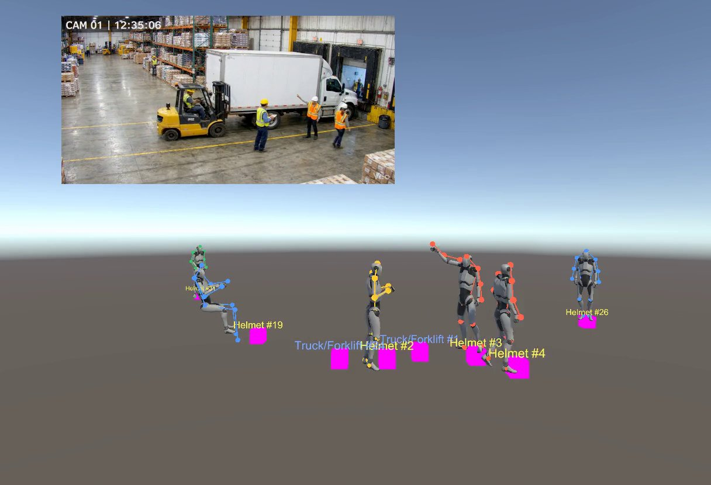
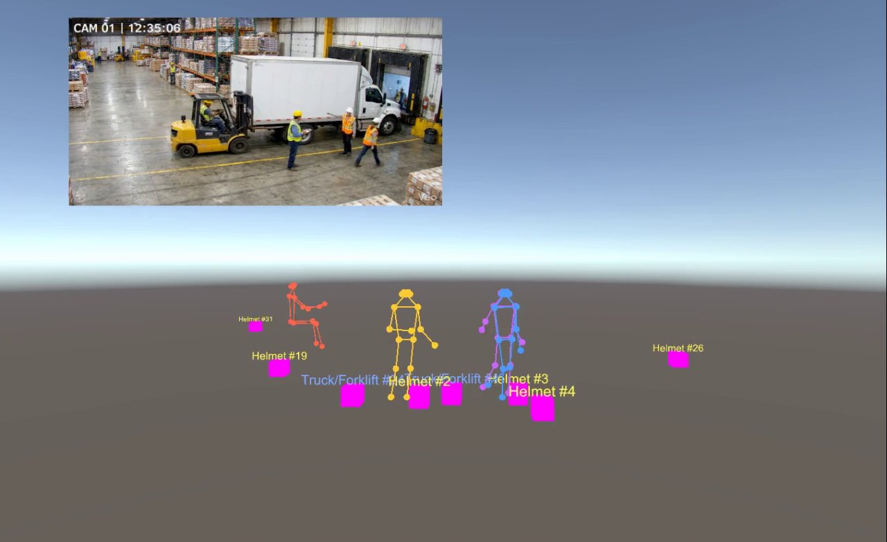

# Data2Avatar

CCTV 영상 → Unity 3D 디지털 트윈. 사람 아바타 + 사물(헬멧·안전조끼·지게차)을 실세계 좌표에 자동 배치하여 작업장 안전을 실시간 모니터링합니다.

> **동기화 지연 ≤ 150ms, 위험 탐지 ≤ 3초** — 산업안전 모니터링용 디지털트윈

> 4종 포즈 모델(GVHMR · ViTPose · RTMPose · YOLO-Pose) 동시 운용. Unity 드롭다운 즉시 전환. 같은 COCO17 TCP 프로토콜로 코드 변경 0.

---

## 스크린샷

### 오프라인 — GVHMR 단일 아바타

> Unity 6 에디터 · CCTV 사무실 영상 → SMPL 24관절 → COCO17 리매핑 → Humanoid 본 회전. 본 위치 디버그 로그가 콘솔에 실시간 출력.

### 오프라인 — GVHMR + YOLO-World 사물 결합

> 창고 CCTV에서 5명 풀바디 메시 + helmet/forklift 위치를 동시에 트윙. 같은 VideoPlayer.frame 동기화로 drift 0.

### 실시간 — RTMPose-L + YOLO 스트리밍

> 같은 영상을 RTMPose-L 실시간 모드로 처리. 5명 ~50–60ms (목표 150ms 충족). 와이어프레임 색상은 트랙 ID별.

---

## 시스템 구조

```
CCTV MP4 / RTSP
  │
  ├─ [사람 경로]                            [사물 경로]
  │   YOLO11x + ByteTrack                   YOLO-World (open-vocab)
  │      ↓                                     + ByteTrack
  │   ViTPose / RTMPose / GVHMR                  ↓
  │      ↓                                  카메라 기하
  │   SMPL FK (24관절)                       지면 투영 (Y=0)
  │      ↓                                     ↓
  │   후처리 (미러/스케일/스무딩/X궤적보정)  필터 (50m 이내)
  │      ↓                                     ↓
  │   COCO17 .bin / TCP                     ObjectPacket .bin / TCP
  │
  └─→ [Unity] PoseStreamSystem
        ├─ PoseSourceSelector  ─ 드롭다운 (Local/9003/9004/9005/9006)
        ├─ LocalPosePlayer     ─ .bin 재생 + VideoPlayer 동기화
        ├─ TcpPoseReceiver     ─ TCP 실시간 수신
        ├─ HumanoidPoseDriver  ─ PointBoneAt 본 회전
        └─ ObjectPlacer        ─ 클래스별 프리팹/플레이스홀더
```

## 4종 모델 동시 운용

| Port | 서버 | 모델 | 5명 처리 | 품질 | 용도 |
|------|------|------|---------|------|------|
| 9003 | GVHMR 스트림 | GVHMR (HMR4D) | 오프라인 재생 | **최고** | DB 구축, 정밀 분석 |
| 9004 | YOLO-Pose | yolov8x-pose | ~60–75ms | 낮음 (튐) | 초저지연 |
| 9005 | ViTPose-H | ViTPose-H | ~197ms | 최고 | 고정밀 실시간 |
| 9006 | **RTMPose-L** | RTMPose-L | **~50–60ms** | 높음 | **권장 균형점** |

모든 서버가 **동일한 COCO17 바이너리 TCP 프로토콜**을 사용 → Unity는 포트만 바꿔 재연결, 코드 변경 0.

## 사물 감지 (Open-Vocabulary)

YOLO-World로 텍스트 프롬프트만으로 새 클래스 추가. 현재: `helmet`, `safety vest`, `industrial truck`.

| 클래스 | bbox 기준 | 비고 |
|--------|-----------|------|
| helmet | **estimate_feet** (bbox 바닥 + 높이×7) | 머리 위치 → 발 위치 추정 |
| safety vest | center_bottom | 가슴 중앙 |
| industrial truck | center_bottom | 바퀴 기준 |

## 기술 스택

- **서버**: Python · Docker · RTX 5090 32GB
- **포즈 모델**: GVHMR (HMR4D, SMPL) · ViTPose-H · RTMPose-L · YOLO11x-Pose
- **사물 모델**: YOLO-World v2 (CLIP 기반 open-vocab) · ByteTrack
- **Unity**: 6.0 LTS · URP · Humanoid · Input System · Universal Animation Rigging
- **프로토콜**: COCO17 바이너리 TCP, ObjectPacket 바이너리 TCP

## 후처리 파이프라인 (사람)

```
SMPL24 → COCO17 리매핑
  ↓
L/R pelvis X 미러링       (SMPL +X=해부학좌 → Unity +X=해부학우)
  ↓
트랙당 키 스케일링         (관측 키 90p → 1.7m, pelvis 중심 uniform)
  ↓
트랙당 median XZ offset   (ground projection 중앙값으로 글로벌 정렬)
  ↓
Pelvis XZ Gaussian 스무딩 (edge padding으로 경계 0 끌림 방지)
  ↓
X 궤적 median 미러         (이동 성분만 반전, 절대 위치·관절 L/R 불변)
  ↓
Floor align               (전역 Y_min 1% → 0 이동)
```

## 주요 트러블슈팅 이력

| # | 문제 | 원인 | 해결 |
|---|------|------|------|
| 1 | HMR2 SMPL 회전 직접 매핑 실패 | 출력이 axis-angle이 아닌 3×3 회전행렬 + 좌표계 이중 반전 | SMPL 회전 매핑 폐기 → 3D 관절 위치 + PointBoneAt 방식 채택 |
| 2 | Sapiens depth 트랙 간 Y 불일치 | 상대 깊이만 제공, 절대 미터 아님 | depth 모델 폐기 → GVHMR 단일화 |
| 3 | 정지 사람도 미끄러짐 (Z std 215cm) | bbox 1px = 원거리 Z 10cm + 매 프레임 앵커링 | per-track median offset 1회 + Gaussian 스무딩 |
| 4 | 트랙 끝 pelvis가 0쪽으로 점프 (16m→9m) | np.convolve mode='same' 경계 0 패딩 | edge padding (np.pad mode='edge') |
| 5 | GVHMR 이동 시 X 반대 슬라이드 | GVHMR +X=이미지왼쪽 vs ground projection +X=이미지오른쪽 | 궤적 X median 기준 미러 (이동 성분만 반전) |
| 6 | helmet 지게차 앞 사람이 뒤쪽에 배치 | bbox 바닥 = 목/어깨 (발 아님) | `estimate_feet` 모드 — bbox 높이 × 7 |
| 7 | 모든 관절 Y=0 투영 → 스켈레톤 기울어짐 | 머리(Y=1.65m)를 지면에 투영 | 관절별 예상 Y 평면 + 광선 교차 (Ankle 0 / Knee 0.5 / Shoulder 1.4 / Nose 1.65m) |
| 8 | 복합 회전 카메라(pitch+yaw+roll) 좌표 어긋남 | 단순 카메라 가정 위반 | 단순 카메라(pitch만)에서만 안정. 복합 회전은 별도 캘리브레이션 도구 필요 |

## Unity 통합 — PoseSourceSelector

플레이 중 Inspector 드롭다운으로 즉시 전환:

```
LocalBin           → LocalPosePlayer ON, TCP OFF
GvhmrStream        → TCP port 9003
RealtimeYoloPose   → TCP port 9004
RealtimeViTPose    → TCP port 9005
RealtimeRTMPose    → TCP port 9006
```

전환 시 기존 아바타 자동 제거 후 재생성. 트랙 재등장 시 Lerp 대신 즉시 스냅 (OnDisable → `_firstPoseApplied=false`).

## 검증 영상

| 영상 | 해상도 | fps | 프레임 | 상태 |
|------|--------|-----|--------|------|
| cctv.mp4 | 1280×720 | 10 | 632 | 사람 검증 완료 |
| Warehouse_Loading_Dock.mp4 | 1280×720 | 24 | 192 | 사람+사물 동시 |
| Factory_Gate.mp4 | 1280×720 | 24 | 192 | 사물 검증 완료 |
| sample2.mp4 | 1280×720 | 29.4 | 885 | 복합 회전 → 별도 캘리브레이션 필요 |

## 성능 지표

| 지표 | 목표 | 현재 | 상태 |
|------|------|------|------|
| 디지털트윈 동기화 지연 | ≤ 150ms | YOLO-Pose 75ms · RTMPose 60ms (예상) | 충족 |
| 위험 탐지 지연 | ≤ 3초 | Stage 1 ~150ms | 충족 |
| 화면 기능 동작 | ≤ 3초 | Unity 즉시 | 충족 |
| 동시 모니터링 CCTV | > 10개 | 1개 (확장 가능) | 인프라 의존 |
| 위험 탐지 F1 | ≥ 0.85 | Phase D | 진행 중 |
| 위험 예측 정확도 | ≥ 92% | Phase D | 진행 중 |

## 다음 단계

- **Phase A** — RTMPose-L 통합 + Warehouse 5명 품질 검증 (진행 중)
- **Phase B** — 사람+사물 통합 서버 (YOLO 1회 감지로 동시 처리)
- **Phase C** — 안전 규칙 엔진 (안전모 미착용·위험구역 침입·지게차 근접·넘어짐)
- **Phase D** — 위험 행동 패턴 학습 (Transformer / GRU)
- **Phase E** — RTSP 실제 CCTV 연동
