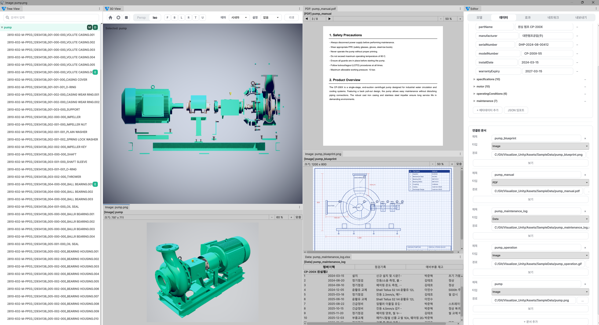
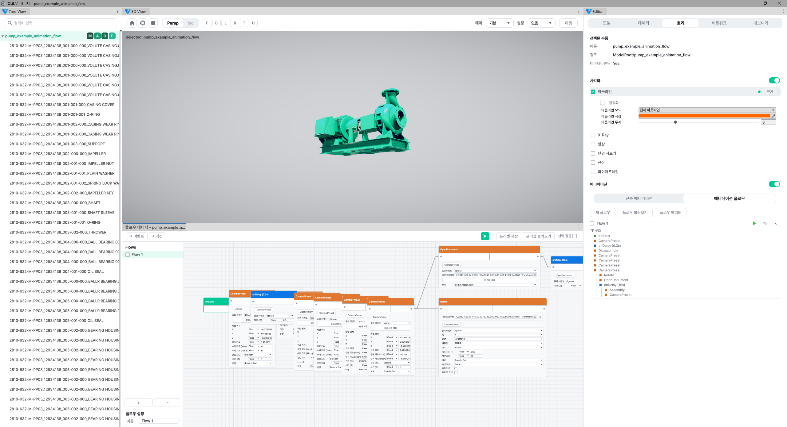
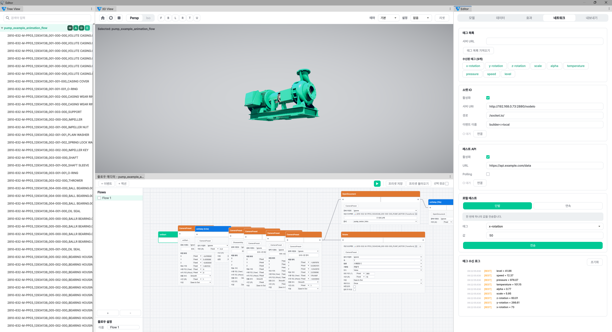
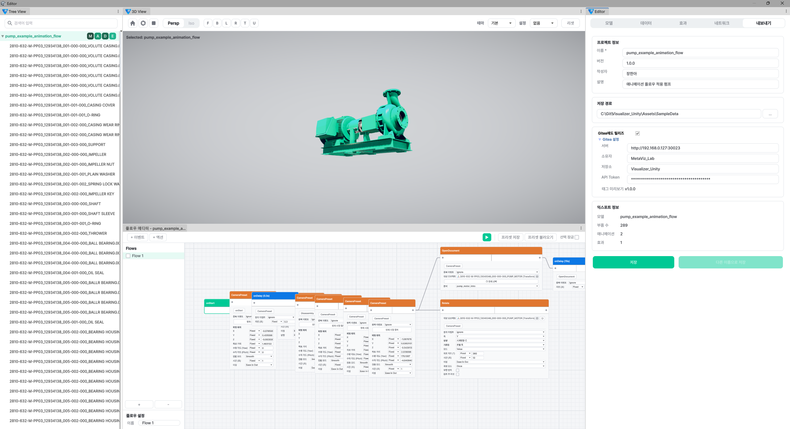

# VTS Visualizer

3D 디지털 트윈 에디터/뷰어 시스템. 산업 설비의 실시간 데이터를 3D에 통합하고, 웹 스트리밍으로 어디서든 모니터링할 수 있습니다.

> 기존 12개월 소요 규모의 시스템을 AI 활용하여 **1개월 내 핵심기능 완료**

---

## 스크린샷

### Viewer (독립 실행 뷰어)

> 도킹 레이아웃 · 트리뷰 · 3D 뷰 · PDF/이미지 뷰어 · 메타데이터 패널 · 문서 목록

### Editor (Unity 에디터 커스텀)

> 노드 기반 애니메이션 플로우 에디터 · 이벤트/액션 노드 시각적 구성


> 효과 컨트롤러 설정 · Outline, XRay, CrossSection 등


> 네트워크 설정 · REST API, Socket.IO, LiveKit WebRTC 연동

---

## 시스템 구조

```
┌─────────────────────────────────────────────────────────────┐
│                     VTS 전체 시스템 구조                      │
├─────────────────────────────────────────────────────────────┤
│                                                              │
│  Unity Editor (에디터)                                       │
│    • 모델 임포트 (FBX, OBJ, GLTF)                           │
│    • 효과/애니메이션 설정                                    │
│    • 태그 데이터 바인딩 (서버 연동)                          │
│    • 문서/영상 링크                                          │
│    • Export → .vproj                                         │
│         │                                                    │
│         ▼                                                    │
│  ┌──────────────┐      ┌──────────────┐                     │
│  │ VTS Builder  │─────▶│  서버 PC     │                     │
│  │ (워크플로우) │ 실행 │ Viewer.exe   │                     │
│  │ Socket.IO    │      │ LiveKit SFU  │                     │
│  └──────────────┘      └──────┬───────┘                     │
│                               │ WebRTC                       │
│                               ▼                              │
│                    ┌───────────────────┐                     │
│                    │ Presenter (iframe)│                     │
│                    │ 웹 브라우저 시청  │                     │
│                    └───────────────────┘                     │
└─────────────────────────────────────────────────────────────┘
```

---

## 에디터 구조

### 3-View 시스템

| View | 설명 |
|------|------|
| **Tree View** | 모델 계층 구조 탐색, 검색/필터링, 데이터 상태 뱃지 (M/T/D/E/A) |
| **3D Scene View** | 카메라 조작 (Orbit/Pan/Dolly/Fly), Perspective/Isometric 전환, 씬 프리셋 6종, 3점 조명 |
| **Editor View** | 5단계 워크플로우 탭 (아래 참조) |

### EditorView 워크플로우

| Step | 이름 | 주요 기능 |
|------|------|----------|
| 1 | **Model** | 모델 임포트/로드, 계층 구조 확인 |
| 2 | **Data** | 메타데이터 (Key-Value, 중첩 JSON), 연결 문서 (PDF/영상/GIF/Web/Data) |
| 3 | **Effects** | 시각 효과 9종 설정, 노드 기반 애니메이션 플로우 |
| 4 | **Network** | REST API, Socket.IO 설정, Mock 테스트, 수신 로그 |
| 5 | **Export** | 프로젝트 설정, .vproj 익스포트 |

---

## 시각 효과 컨트롤러 (9종)

커스텀 HLSL 셰이더로 구현된 실시간 시각 효과 시스템.

| 효과 | 설명 |
|------|------|
| **Outline** | 외곽선 효과, 5가지 모드 (Stencil 기반) |
| **X-Ray** | Fresnel 기반 반투명 투과 |
| **Alarm** | 경고 점멸, 맥동 발광 |
| **Cross Section** | 단면 절단 — Plane/Sphere/Box/Cylinder 4모드, 최대 8개 동시 |
| **Disassembly** | 분해/조립 애니메이션, 방향 6종, 속도 0.5x~3x |
| **Ghost Effect** | 잔상 효과, 이동 궤적 시각화 |
| **Wireframe** | 와이어프레임/쉐이딩 모드 전환 |
| **Animation** | FBX 내장 애니메이션 클립 재생 |
| **Transform** | 회전/이동/크기 애니메이션 |

---

## 노드 기반 애니메이션 플로우

노드 그래프 에디터로 복잡한 애니메이션 시퀀스를 시각적으로 구성.

### Event 노드 (트리거)

| 노드 | 트리거 |
|------|--------|
| OnStart | 씬 시작 시 즉시 |
| OnClick | 오브젝트 클릭 시 |
| OnDelay | 지정 시간 후 |
| OnTagValue | 서버 태그 값 조건 충족 시 |

### Action 노드 (동작)

| 노드 | 동작 |
|------|------|
| Rotate / Position / Scale | Transform 변형 |
| Color / Opacity | 색상·투명도 변경 |
| PlayModelClips | FBX 애니메이션 그룹 재생 |
| Disassembly / Assembly | 분해·조립 |
| CameraLookAt / CameraZoom / CameraMove | 카메라 제어 |
| OpenDocument | 문서 열기 |

- 병렬 Fork 분기, 1회성(One-time) 옵션, 다중 플로우 지원
- 단순 애니메이션: 플로우 에디터 없이 인스펙터에서 직접 설정 가능

---

## 뷰어 시스템

UI Toolkit 기반 독립 실행 뷰어 (Viewer.exe).

| 패널 | 설명 |
|------|------|
| **트리뷰** | 모델 계층 탐색, 부품 선택 |
| **3D 뷰** | 렌더링, 카메라 조작, 씬 프리셋 툴바 |
| **정보 패널** | 메타데이터, 연결 문서 목록 |
| **애니메이션 패널** | 독립 재생/정지, 체크박스 다중 선택, 실행 상태 시각화 |
| **문서 뷰어** | PDF, 이미지(GIF 애니메이션), 동영상, 웹, 데이터(JSON/CSV/Excel/XML) |
| **네트워크 로그** | Socket.IO / REST 수신 로그 |

- **도킹 시스템**: 패널 자유 배치, 드래그로 레이아웃 변경
- **LiveKit WebRTC 스트리밍**: VP8 인코딩, Presenter iframe으로 웹 송출
- **원격 조작**: ControlWS를 통한 카메라/UI 입력 릴레이

---

## 데이터 바인딩

| 유형 | 설명 |
|------|------|
| **MetaData** | 오브젝트별 Key-Value 속성, JSON 일괄 임포트 지원 |
| **Tag Binding** | 서버 태그 값 연동 → 값에 따라 색상/상태 자동 변경 |
| **Linked Documents** | PDF, Video, Image, Excel, JSON/CSV, Web URL |

---

## 서버 연동

| 프로토콜 | 용도 |
|---------|------|
| **REST API** | 태그 목록 조회 |
| **Socket.IO** | 실시간 태그 데이터 Push |
| **LiveKit WebRTC** | Viewer → SFU → Presenter iframe 웹 스트리밍 |
| **ControlWS** | 브라우저 → Viewer 원격 조작 (카메라/UI 입력) |
| **Named Pipe** | Viewer 실행 중 프로젝트 동적 교체 |

---

## Export / Import

```
project.vproj (ZIP)
├── model.bundle       ← AssetBundle (메시, 머티리얼, 텍스처, 애니메이션 클립)
├── settings.json      ← 컴포넌트 설정 + 태그 바인딩 + 네트워크 설정
├── manifest.json      ← 프로젝트 정보, 버전
└── attachments/       ← 연결 문서 파일 (PDF, 이미지 등)
```

---

## 기술 스택

`Unity 6` `URP 17.3` `C#` `HLSL Shader` `UI Toolkit` `Socket.IO` `WebRTC` `LiveKit` `REST API` `Node.js`

**외부 플러그인**: Paroxe PDFRenderer · Vuplex WebView · ExcelDataReader

---

> 🔒 이 저장소는 private 프로젝트의 README 공개 버전입니다.
